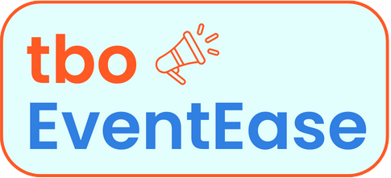
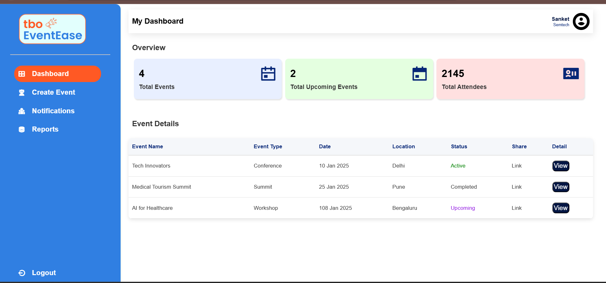
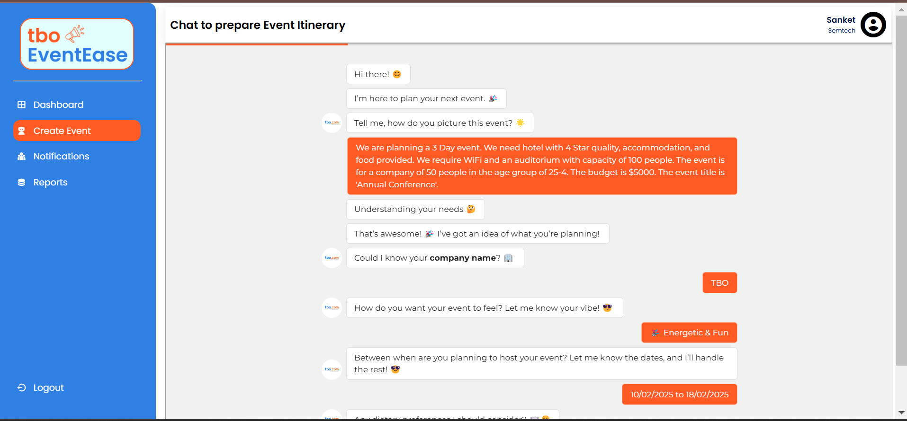
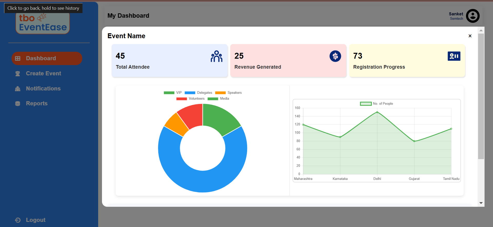

<!-- PROJECT LOGO -->
<div align="center">
    <!--  -->
    
  <h1 align="center"><b>tboEventEase: Easing Event Travel & Planning seamless and efficient.</b></h1>

</div>

<!-- ABOUT THE PROJECT -->
<br>

## ♾️ Problem Statement

There is a huge problem in the complexity of manually managing event & travel itineraries, leading to inefficiencies and a poor attendee experience.

## ♾️ Solution

tbo EventEase is a digital platform that simplifies event management for both organizers and attendees in the MICE industry.
For organizers, it streamlines venue selection, event creation, and attendee management through real-time integrations with the TBO API.

Attendees benefit from personalized itineraries, seamless registration, and automated updates, ensuring an engaging and efficient event experience.

### For Organizers:

- Streamlined Venue Booking and Event Creation

  - Search and book hotels/conference halls using natural language prompts.
  - Utilize TBO APIs to get real-time availability of venues and finalize bookings efficiently.
  - Create an event page with all necessary details (schedule, location, and other information) in few clicks.

- Effortless Event Management and Attendee Engagement
  - Public/Private Registration links, itinerary planners, and tickets are automatically generated.
  - Notifications and Reminders: Via email, call, and Google Calendar integration to keep attendees updated.

### For Attendees:

- Personalized Itinerary: Custom itineraries based on user preferences like budget, location, and event schedule.

- Best Deals: Access to the best deals for accommodation, travel, and other services, ensuring cost-effective options.

- Active Notifications: Real-time updates via email, calls, and Google Calendar integration to keep attendees informed.

- Networking Opportunities: Connect with other attendees traveling from the same location, facilitating easy networking and collaboration.

## ⚙️ Built With

The technologies and tools used are:

- LLM
- Langchain
- Groq
- Pinecone
- Langflow
- NLP
- HTML
- CSS
- Javascript
- Python
- NodeJS
- ExpressJS
- Bootstrap

<!-- GETTING STARTED -->

## 🧑‍💻 Getting Started

### Installation

1. Clone the repository

   ```sh
   https://github.com/sanketdisale871/tbo-EventEase.git
   ```

2. Install the dependencies:

   ```sh
   npm i
   ```

3. Start Application:
   ```sh
   nodemon index.js
   ```

<!-- CONTRIBUTING -->

## Some Glimpses of tboEventEase -->

- Dashboard
  

- Create Event
  

- Event Info.
  

- Attendee Page
  

- Attendee Reg. Page
  
